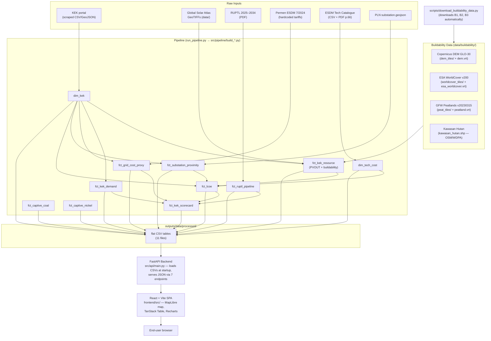

# Architecture — Indonesia KEK Power Competitiveness

## Table of Contents

- [System Overview](#system-overview)
- [Technology Stack](#technology-stack)
- [Pipeline Dependency Graph](#pipeline-dependency-graph)
- [Key Design Decisions](#key-design-decisions)
  - [1. Star Schema — Dim + Fact Tables](#1-star-schema--dim--fact-tables)
  - [2. Precomputed Flat Tables — No Runtime Raster Operations](#2-precomputed-flat-tables--no-runtime-raster-operations)
  - [3. Builder Pattern — One Function Per Pipeline Step](#3-builder-pattern--one-function-per-pipeline-step)
  - [4. PDF Extractor Pattern — Pdfplumber + Hardcoded Fallback](#4-pdf-extractor-pattern--pdfplumber--hardcoded-fallback)
  - [5. Pure-Function Buildability Filters — No I/O, Fully Testable](#5-pure-function-buildability-filters--no-io-fully-testable)
- [Buildability Data Flow](#buildability-data-flow)
- [Module Map](#module-map)

---

## System Overview



---

## Technology Stack

| Layer | Technology | Version | Purpose |
|-------|-----------|---------|---------|
| Backend runtime | Python | 3.11 | Pipeline, model, and API code |
| Backend API | FastAPI | latest | REST API serving scorecard and layer data |
| Package manager | uv | latest | Python dependency resolution + venv |
| Frontend | React + TypeScript | 18.x | SPA dashboard |
| Frontend bundler | Vite | 5.x | Dev server + production build |
| Map | MapLibre GL JS | 4.x | Interactive map via react-map-gl |
| Table | TanStack Table | 8.x | Sortable, filterable data table |
| Charts | Recharts | 2.x | Quadrant chart, RUPTL bar chart |
| State | Zustand | 5.x | Client-side state management |
| CSS | Tailwind CSS | 3.4 | Utility-first dark theme styling |
| Formatting (Python) | ruff | latest | Python linting + formatting (pre-commit) |
| Formatting (TS) | Biome | 2.x | TypeScript linting + formatting (pre-commit) |
| Geospatial raster | rasterio | 1.3+ | GeoTIFF window reads, VRT operations |
| Geospatial vector | geopandas | 0.14+ | KEK polygons, substation proximity |
| Numerical | numpy, scipy | — | Raster array ops, connected-component labeling |
| Data | pandas | 2.x | All tabular transforms |
| PDF extraction | pdfplumber | — | RUPTL + ESDM Tech Catalogue tables |
| Testing | pytest | — | 386 tests, all pure-function |
| Linting | ruff | — | Format + lint (configured in pyproject.toml) |

---

## Pipeline Dependency Graph

Topological order enforced by `run_pipeline.py` at runtime:

```
Stage 1 — Dimensions (no deps)
  dim_kek
  dim_tech_cost

Stage 2 — Facts (depend on dim_kek)
  fct_kek_resource          ← dim_kek  [+ data/buildability/ when populated]
  fct_kek_demand            ← dim_kek
  fct_grid_cost_proxy       ← dim_kek
  fct_ruptl_pipeline        (no deps)
  fct_substation_proximity  ← dim_kek

Stage 3 — Computed
  fct_lcoe                  ← dim_kek, fct_kek_resource, dim_tech_cost, fct_substation_proximity

Stage 4 — Captive power
  fct_captive_coal          ← dim_kek
  fct_captive_nickel        ← dim_kek

Stage 5 — Final scorecard
  fct_kek_scorecard         ← dim_kek, fct_lcoe, fct_grid_cost_proxy, fct_ruptl_pipeline, fct_kek_demand, fct_captive_coal, fct_captive_nickel
```

Run a single step: `uv run python run_pipeline.py fct_kek_scorecard`
Run full pipeline: `uv run python run_pipeline.py`

---

## Key Design Decisions

### 1. Star Schema — Dim + Fact Tables

All data is stored as a star schema (dimension + fact tables) rather than a single denormalised CSV. `dim_kek` is the central entity; every fact table joins to it on `kek_id`. This allows each pipeline step to be independently rebuilt without invalidating the full dataset, and keeps the API's startup load small — eleven small CSVs instead of one wide join.

### 2. Precomputed Flat Tables — No Runtime Raster Operations

The Dash app reads precomputed CSV tables at startup. All raster operations (PVOUT extraction, slope/elevation masking, ESA WorldCover land cover, peatland exclusion, Kawasan Hutan rasterisation) happen offline in `build_fct_kek_resource.py`. This keeps the dashboard stateless and fast — the heaviest raster job (~17 peatland tiles + DEM) takes ~3 minutes once; the app never touches a GeoTIFF.

### 3. Builder Pattern — One Function Per Pipeline Step

Each pipeline step is a single `build_<name>() → pd.DataFrame` function in `src/pipeline/build_<name>.py`. The orchestrator (`run_pipeline.py`) handles dependency ordering via topological sort and writes each output to `outputs/data/processed/`. Adding a new step means: write one builder file, add one `Step(...)` entry. See `src/pipeline/TEMPLATE.py` for the canonical pattern.

### 4. PDF Extractor Pattern — Pdfplumber + Hardcoded Fallback

Two PDF sources (RUPTL, ESDM Tech Catalogue) are parsed by `src/pipeline/pdf_extract_*.py`. Each extractor tries pdfplumber first; if the page is image-based, the PDF is missing, or the layout changes, it falls back to a `VERIFIED_*` hardcoded dict that was manually verified against the source. The public API always returns data — callers never receive None. The `VERIFIED_*` dicts are the single source of truth for hardcoded values and are tested for exact match.

### 5. Pure-Function Buildability Filters — No I/O, Fully Testable

`src/pipeline/buildability_filters.py` contains zero file I/O. Every filter function accepts numpy arrays and returns numpy arrays. This makes the four buildability layers (slope/elevation, ESA WorldCover, GFW peatlands, Kawasan Hutan) independently unit-testable with synthetic rasters — no real GeoTIFFs required in the test suite. The integration (reading VRTs, windowing to KEK bounding boxes) lives exclusively in `build_fct_kek_resource.py`.

---

## Buildability Data Flow

`fct_kek_resource` is the only pipeline step that reads raster data at build time. When `data/buildability/` is populated (run `scripts/download_buildability_data.py`), the four layers are applied in cascade per KEK:

```
PVOUT GeoTIFF (Global Solar Atlas, ~1km)
  ↓
Window to KEK 50km bounding box
  ↓
Layer 1a: kawasan_hutan.shp   → rasterize → binary mask → zero excluded pixels
Layer 1b: peatland.vrt        → read window → pixel > 0 = peat → zero excluded pixels
Layer 1c/d: esa_worldcover.vrt → read window → codes 10,40,50,80,90,95 → zero excluded pixels
Layer 2a/c: dem.vrt           → read window → compute slope → exclude slope>8° or elev>1500m
Layer 4: min area filter      → drop contiguous buildable patches < 10 ha
  ↓
buildable_area_ha             = n_buildable_pixels × pixel_area_ha
max_captive_capacity_mwp      = buildable_area_ha / 1.5 ha/MWp
pvout_buildable_best_50km     = max PVOUT value across all buildable pixels
buildability_constraint       = dominant filter layer (kawasan_hutan / peat / agriculture / slope / unconstrained)
```

When `data/buildability/` is absent, all four buildability columns are `NaN` and `resource_quality = "upper_bound"`.

---

## Module Map

```
src/
  model/
    basic_model.py              — Pure LCOE + action flag functions (no Dash dep)
  pipeline/
    build_dim_kek.py
    build_dim_tech_cost.py
    build_fct_kek_resource.py   ← heaviest; raster reads + buildability cascade
    build_fct_kek_demand.py
    build_fct_grid_cost_proxy.py
    build_fct_ruptl_pipeline.py
    build_fct_substation_proximity.py
    build_fct_lcoe.py
    build_fct_kek_scorecard.py
    build_fct_captive_coal.py   ← GEM GCPT coal plants within 50km of each KEK
    build_fct_captive_nickel.py ← CGSP nickel smelters within 50km of each KEK
    buildability_filters.py     ← pure filter functions, zero I/O
    pdf_extract_ruptl.py
    pdf_extract_esdm_tech.py
    TEMPLATE.py                 ← canonical template for new pipeline steps
  assumptions.py                — All model constants with source citations

scripts/
  download_buildability_data.py — Downloads DEM + ESA WorldCover + GFW peatlands; builds VRTs

tests/
  test_model.py                 — 60 tests for basic_model.py
  test_pipeline.py              — 146 tests for pipeline + buildability filters

run_pipeline.py                 — Orchestrator: topological sort + step runner
```
